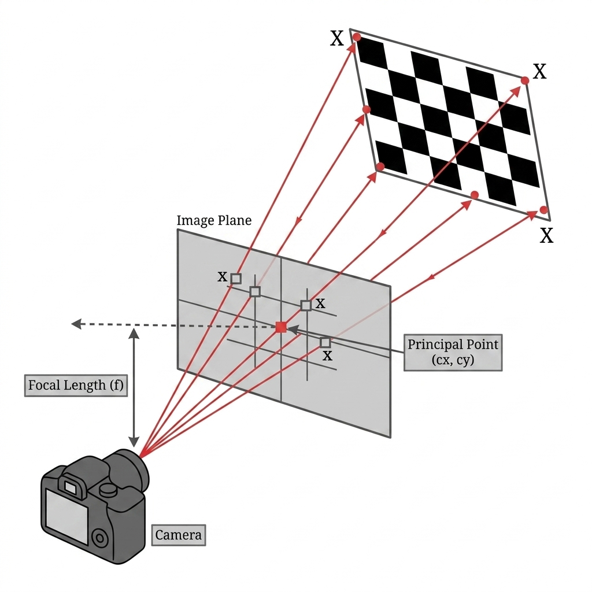

## Theory

 

 
### 1. Why Calibration Is Needed
 
Every camera lens bends light uniquely based on its specific lens and sensor combination. If we don't know exactly how a lens bends light, any measurements taken from its images will have systematic errors. For example, a depth formula like Z = (f × B) / d (from Experiment 1) assumes we know the focal length f precisely. If f is off by just 5%, every depth measurement in the scene will be wrong by 5%. This isn't random noise; it's a consistent error that you can't simply average away by taking more measurements.
 
Camera calibration is the mathematical process of characterizing a camera so we can trust its image measurements for real-world geometric calculations. It helps us figure out three main things:
 
- **Intrinsic parameters** — properties of the lens and sensor, like focal length and the principal point.
- **Distortion coefficients** — a measure of how much the lens bends straight lines into curves.
- **Reprojection error** — a quality metric that shows how well our estimated parameters match the actual observed images.

### 2. The Camera Projection Model
 
A 3D world point X = (X, Y, Z) is projected onto a 2D image point x = (u, v) using the camera projection equation:
 

  <b>x</b> = <b>K</b> [<b>R</b> &mid; <b>t</b>] <b>X</b>

 
Where:
 
- **K** is the 3×3 camera intrinsic matrix.
- **[<i>R</i> &mid; <i>t</i>]** is the 3×4 extrinsic matrix. This represents the rotation <i>R</i> and translation <i>t</i> that describe the camera's location in the world.
- **X** is the 3D world point in homogeneous coordinates.

The intrinsic matrix K contains all the internal optical properties of the camera:
 

  <i>K</i>&nbsp;=&nbsp;
  

    

      
<i>f</i><i>x</i>

0

<i>c</i><i>x</i>

      
0

<i>f</i><i>y</i>

<i>c</i><i>y</i>

      
0

0

1

    

  

 
Where:
- **fx, fy** — focal lengths in pixels along the horizontal and vertical axes. While these are equal for most cameras, slight manufacturing variations can cause them to differ slightly.
- **cx, cy** — the principal point, which is the pixel coordinate where the optical axis of the lens intersects the image sensor. Ideally, this sits right in the exact centre of the image, but in reality, it's often offset slightly.

### 3. Lens Distortion
 
Real camera lenses aren't perfect. They introduce geometric distortion that bends straight lines in the world into curves in the image. The most dominant type is radial distortion, which pulls pixels inward (barrel distortion, negative k1) or pushes them outward (pincushion distortion, positive k1) from the image centre.
 
The radial distortion correction model looks like this:
 

  <i>x</i>corrected = <i>x</i>raw (1 + [<i>k</i>1 &times; <i>r</i>2] + [<i>k</i>2 &times; <i>r</i>4])
   
  <i>y</i>corrected = <i>y</i>raw (1 + [<i>k</i>1 &times; <i>r</i>2] + [<i>k</i>2 &times; <i>r</i>4])

 
Where:
- **<i>r</i>2 = <i>x</i>2 + <i>y</i>2** — the squared distance from the principal point in normalised image coordinates.
- **<i>k</i>1** — the primary radial distortion coefficient. Wide-angle lenses typically have <i>k</i>1 between −0.3 and −0.5 (indicating barrel distortion).
- **<i>k</i>2** — a higher-order radial correction term, which is much smaller than <i>k</i>1.

Tangential distortion (measured with coefficients p1, p2) happens when the lens isn't perfectly parallel to the sensor plane:
 

  <i>x</i>tangential = 2<i>p</i>1<i>xy</i> + <i>p</i>2(<i>r</i>2 + 2<i>x</i>2)

  <i>y</i>tangential = <i>p</i>1(<i>r</i>2 + 2<i>y</i>2) + 2<i>p</i>2<i>xy</i>

 
In practice, tangential distortion is quite small and often safely ignored for non-precision tasks.
 
### 4. Zhang's Calibration Method
 
Published in 1999 and 2000, Zhang's method revolutionised camera calibration. Instead of relying on expensive 3D reference objects or precision calibration rigs, it simply requires a flat printed checkerboard photographed from multiple orientations.
 
The method works in four stages:
 
**Stage 1 — Homography estimation per pose**
 
For a flat checkerboard (where Z = 0 in world coordinates), the 3D-to-2D mapping simplifies from the full projection equation down to a 3×3 homography matrix:
 

  <i>H</i>&nbsp;=&nbsp;<i>K</i>
  

    

      
<i>r</i>1

<i>r</i>2

<i>t</i>

    

  

 
Here, r1 and r2 are the first two columns of the rotation matrix R, and t is the translation vector. Each calibration pose (i.e., one photograph of the board) provides a single homography H. We estimate this using the known checkerboard corner positions alongside their detected pixel positions in the image.
 
**Stage 2 — Extracting K from multiple homographies**
 
A single homography H has 8 degrees of freedom, whereas K has 5 unknowns (fx, fy, cx, cy, and the skew, which is generally assumed to be zero). Because of this, one pose isn't enough. By stacking constraints from N ≥ 3 poses, we can form a linear system:
 

  <b>V</b> &middot; <b>b</b> = 0

 
V is a matrix built from the homographies, and b encodes the elements of K. We solve this system using Singular Value Decomposition (SVD) — the solution ends up being the eigenvector of VᵀV corresponding to the smallest eigenvalue.
 
**Stage 3 — Estimating distortion coefficients**
 
Once K is known, the distortion coefficients k1 and k2 are estimated by seeing how much the detected corners deviate from where the undistorted model predicts they should be. This gives us a linear least-squares problem, which is again solved via SVD.
 
**Stage 4 — Refinement by nonlinear optimisation**
 
Finally, the initial linear estimate is refined using Levenberg-Marquardt nonlinear optimisation. This process aims to minimise the total reprojection error across all captured poses.
 
### 5. Reprojection Error
 
Reprojection error serves as the primary quality metric for camera calibration. It measures how far the known 3D checkerboard corners—when projected back into the image using the estimated K and distortion model—land from their actual detected pixel positions:
 

  &epsilon;&nbsp;=&nbsp;&radic;
    
      1
      <i>N</i>
    
    &sum;<i>i</i>
    || <i>m</i><i>i</i> &minus; <i>m̂</i>(<i>K</i>, <i>kc</i>, <i>R</i><i>i</i>, <i>t</i><i>i</i>, <i>M</i><i>i</i>) ||2
  

 
Where:
- **<i>m</i><i>i</i>** — the observed pixel position of corner <i>i</i>.
- **<i>m̂</i>(...)** — the projected position using our estimated parameters.
- The final result is expressed in pixels.

Interpretation of reprojection error values:
 
| Reprojection Error | Quality |
|---|---|
| Below 0.5 px | Excellent — suitable for precision measurement |
| 0.5 to 1.0 px | Good — acceptable for most applications |
| 1.0 to 2.0 px | Usable — double-check pose diversity and board print quality |
| Above 2.0 px | Poor — calibration should be rejected and repeated |
 
### 6. What Affects Calibration Quality
 
**Number of poses** — Gathering more poses provides extra constraints for the linear system. If you capture fewer than 5 poses, the matrix becomes poorly conditioned and K is unstable. Improvement generally levels off around 20 to 25 poses — adding more after that won't yield much benefit.
 
**Pose diversity** — Your poses need to cover a wide variety of orientations. If all photos are taken from the same angle, certain parameters of K can't be independently estimated. Make sure to tilt the board in all three rotational axes across your set of poses.
 
**Board quality** — You have to measure the physical square size precisely from the printed board. A 1 mm error in square size will directly carry over into a scale error for the recovered focal length.
 
**Corner detection accuracy** — Getting sub-pixel corner detection right is essential. Blurry images, bad lighting, or partially visible boards will degrade corner localisation, which in turn increases your reprojection error.
 
### 7. Connection to Experiment 1
 
The camera matrix K recovered here contains the focal length f used in Experiment 1's depth formula Z = fB/d. Trying to use an incorrectly calibrated f will cause a systematic depth error across the entire scene. If f is overestimated by 5%, every depth reading will be 5% too large. Camera calibration isn't optional — it's the strict prerequisite for any accurate 3D measurement.
