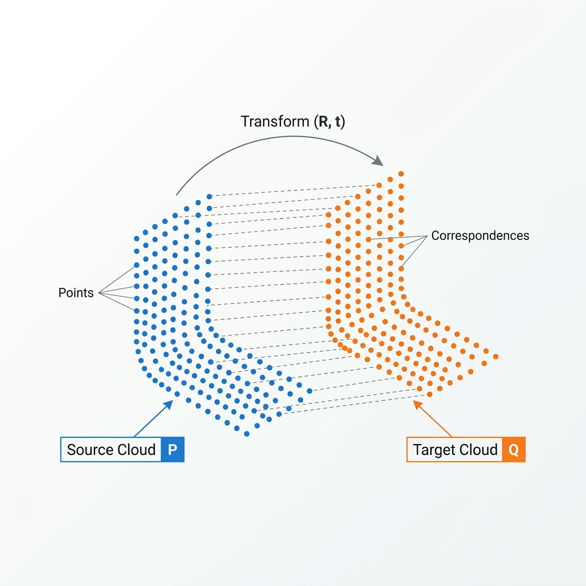

## Theory
 
### 1. Why Registration Is Needed
 
Imagine taking a single photograph of a coffee mug. You can see the front, but the handle and the back are completely hidden. 3D scanning works the exact same way—a single scan from one camera position captures only the visible side of an object. 

To build a complete, 3D digital replica, you need to scan the object from multiple different angles. However, each resulting "partial point cloud" is captured in its own local coordinate space, essentially anchored to wherever the scanner happened to be pointing at that moment. Before these puzzle pieces can be merged into a solid 3D model, they must all be mathematically transformed into one shared coordinate system. 

This critical alignment process is called **registration**. Without it, your multiple scans would simply float aimlessly in virtual space, disconnected and meaningless, even though they represent the exact same physical object.
 
### 2. The Iterative Closest Point Algorithm
 
The **Iterative Closest Point (ICP)** algorithm is the industry standard for stitching two point clouds together. It is generally used when an initial, rough alignment is already available (so the clouds are at least somewhat close to each other). 

ICP is brilliantly simple in concept. It repeats a four-step loop until the alignment stops getting better:
 
1. **Find Correspondences:** For every point in the "source" cloud, the algorithm looks for its nearest neighbouring point in the "target" cloud. These pairs are temporarily treated as matching points—representing the exact same spot on the physical surface.
2. **Compute the Transformation:** Using all these matched pairs, the algorithm calculates the optimal rotation (R) and translation (t) that would perfectly slide the source points onto their target partners, minimizing the overall distance between them.
3. **Apply the Transformation:** The entire source cloud is then physically moved according to the rotation and translation we just calculated.
4. **Measure the Error (RMSE):** Finally, we measure the Root Mean Square Error (RMSE) between the newly moved source cloud and the target cloud. If the error hasn't dropped much since the last loop, we say the algorithm has **converged**, and we stop. Otherwise, we jump back to Step 1 and repeat the process with our newly moved cloud.
 

  
  
Figure 1: Finding nearest-neighbour correspondences and applying rigid transformation (R,t)

### 3. The ICP Objective Function
 
At its core, ICP is an optimization problem. The mathematical goal it tries to minimize at each step is:
 

  <i>E</i>(<i>R</i>, <i>t</i>)&nbsp;=&nbsp;
  
    <i>N</i>
    &sum;
    <i>i</i>=1
  
  || <i>q</i><i>i</i> &minus; (<i>R</i> <i>p</i><i>i</i> + <i>t</i>) ||2

 
Where:
- **<i>p</i><i>i</i>** = a point in the source cloud
- **<i>q</i><i>i</i>** = the nearest corresponding point found in the target cloud
- **<i>R</i>** = the 3×3 rotation matrix we want to find
- **<i>t</i>** = the 3×1 translation vector (movement) we want to find
- **<i>N</i>** = the total number of matched point pairs

In plain English, this formula calculates the total squared distance between every matched point pair after moving them. ICP's entire job is to find the rotation and translation that makes this total error as small as physically possible.
 
### 4. Solving for the Optimal Transformation
 
You might think that finding the best *R* and *t* requires complex trial and error. Thankfully, we can calculate the absolute optimal answer directly using a closed-form mathematical shortcut known as **Singular Value Decomposition (SVD)**.

First, we find the center of mass (the centroid) of both point clouds:
 

  

    <i>p</i>&nbsp;=&nbsp;
    
      1
      <i>N</i>
    
    
      <i>N</i>
      &sum;
      <i>i</i>=1
    
    <i>p</i><i>i</i>
  

  

    <i>q</i>&nbsp;=&nbsp;
    
      1
      <i>N</i>
    
    
      <i>N</i>
      &sum;
      <i>i</i>=1
    
    <i>q</i><i>i</i>
  

Next, we shift the points so their centroids are at the origin, and build a 3×3 cross-covariance matrix *H*:

  <i>H</i>&nbsp;=&nbsp;
  
    <i>N</i>
    &sum;
    <i>i</i>=1
  
  (<i>p</i><i>i</i> &minus; <i>p</i>)
  (<i>q</i><i>i</i> &minus; <i>q</i>)T

 
We then decompose this matrix using SVD:
 

  <i>H</i>&nbsp;=&nbsp;<i>U</i> &Sigma; <i>V</i>T

 
Finally, the optimal rotation and translation simply fall out of the *U* and *V* matrices!
 

  

    <i>R</i>&nbsp;=&nbsp;<i>V</i> <i>U</i>T
  

  

    <i>t</i>&nbsp;=&nbsp;<i>q</i> &minus; <i>R</i> <i>p</i>
  

 
Because this is a closed-form, direct calculation, each step of the ICP loop runs incredibly fast without needing any guesswork.
 
### 5. Tracking Progress with RMSE
 
To know if our alignment is actually getting better, we calculate the Root Mean Square Error (RMSE) after every single loop:
 

  <i>RMSE</i><i>k</i>&nbsp;=&nbsp;
  &radic;
  
    
      1
      <i>N</i>
    
    
      <i>N</i>
      &sum;
      <i>i</i>=1
    
    || <i>q</i><i>i</i> &minus; (<i>R</i> <i>p</i><i>i</i> + <i>t</i>) ||2
  

 
The algorithm checks to see how much this error has dropped since the last iteration. We define a tiny threshold value (&epsilon;):
 

  | <i>RMSE</i><i>k</i> &minus; <i>RMSE</i><i>k-1</i> | &lt; &epsilon;

 
Once the change in error falls below this threshold, we can confidently say the alignment has stabilized and stop the loop. We also set a maximum iteration limit just in case it gets stuck.
 
### 6. The "Local Minimum" Trap
 
ICP is greedy. It always takes the mathematically best step based on the *current* matched points. However, it is completely blind to the overall, big-picture shape of the objects.

This leads to its biggest weakness: **Local Minima**. If the two point clouds start out way too far apart, the "nearest neighbour" search will mistakenly pair up points that don't actually belong together on the real object. ICP will proudly crunch the numbers, perfectly align these wrong points, and proudly report that it has converged—resulting in an alignment that is mathematically stable but visually broken.

This trap is particularly dangerous for highly symmetrical shapes like spheres or flat planes, where one rotation looks just as valid as another. Asymmetrical, complex shapes with lots of unique bumps and grooves are much easier for ICP to lock onto correctly.
 
### 7. The Importance of Overlap
 
ICP makes a massive assumption: that the points in the source cloud actually *exist* somewhere in the target cloud. 

If the overlap between the two scans is very small (say, only 20%), the nearest neighbour search will aggressively force matches for the remaining 80% of points that literally have no true partner in the target cloud. These forced, fake matches drag the alignment completely off course. A good rule of thumb is that scans should have significant shared surface area for ICP to succeed.
 
### 8. Noise Sets the Floor
 
In the real world, 3D scanners aren't perfect. They capture data with slight inaccuracies and static noise (as you may have seen in Experiment 3). 

Because of this noise, you will almost never achieve a perfect RMSE of exactly `0.0`. Even when the two clouds are perfectly aligned, the noisy, jittered points won't overlap flawlessly. This noise essentially establishes a hard floor for the RMSE—no amount of extra iterations will push the error below the baseline noise level of your hardware.
 
### 9. Tying it all Together
 
ICP is the crucial bridge that takes us from capturing single, isolated point clouds to generating stunning, complete 3D assets. Whether you're inspecting industrial parts on an assembly line, preserving a heritage statue, or helping a self-driving car map its surroundings, the quality of your final 3D model is entirely dependent on how accurately you can register your point clouds together!

