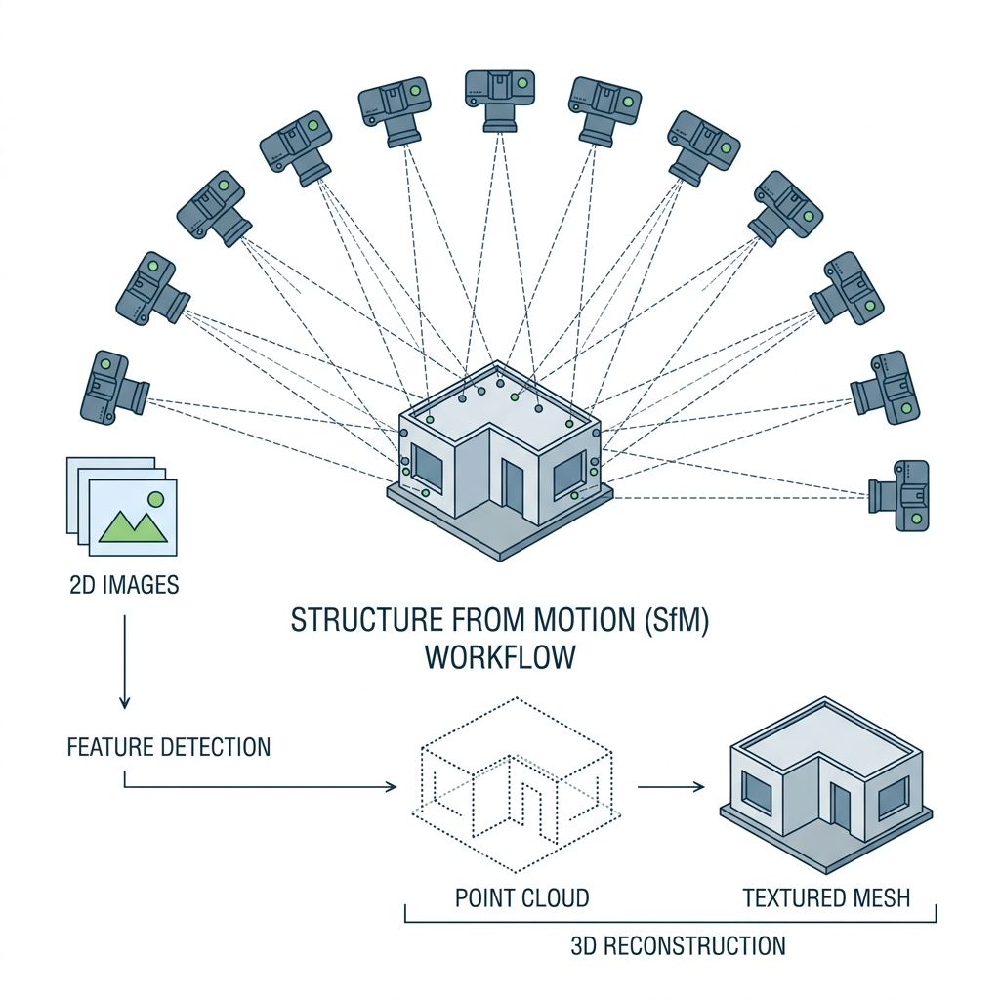

## Theory

### 1. Photogrammetry — Reconstructing 3D from Ordinary Photographs

Every scanning technology studied earlier in this lab — stereo vision, LiDAR, structured light — requires a specialised sensor: a calibrated stereo pair, a laser rangefinder, or a projector-camera system. Photogrammetry, and specifically Structure from Motion, takes a fundamentally different approach: it reconstructs full 3D geometry using nothing more than a set of ordinary overlapping photographs, taken with a single uncalibrated (or only approximately calibrated) camera moved around the subject.

This makes SfM extraordinarily accessible — any digital camera or smartphone can serve as the capture device — but it also makes it computationally far more demanding than the direct measurement techniques studied earlier, since virtually everything (camera positions, camera orientations, and 3D point locations) must be jointly solved for simultaneously from image data alone, rather than measured directly by a sensor.

### 2. The SfM Pipeline Overview

The SfM pipeline proceeds through a sequence of distinct stages, each depending on the output of the one before it:

### 1. Introduction to Structure from Motion (SfM)

Imagine taking dozens of photographs of a beautiful statue from different angles, and having a computer automatically turn those photos into a highly accurate 3D model. That process is called **Structure from Motion (SfM)**. SfM is the core technology behind modern photogrammetry. While earlier experiments in this lab explored how a single pair of cameras can perceive depth (Stereo Vision) and how 3D scans can be stitched together (ICP Registration), SfM takes this to the next level: it simultaneously figures out the 3D structure of the scene *and* the unknown positions of the cameras that took the photos, all without any prior calibration.

  
  
Figure 1: The SfM process reconstructs 3D geometry and camera positions from multiple overlapping 2D images.

SfM relies heavily on discovering overlapping features between images. If you take a photo of a building, move a few steps, and take another, many of the same windows, bricks, and corners appear in both images. By tracking how these features move (or change perspective) between photos, the algorithm can reverse-engineer both the 3D shape of the building and the path you walked.

### 2. The Anatomy of an SfM Pipeline

While different software packages have their own specific quirks, almost every modern SfM system follows a standard sequence of stages:

**Stage 1 — Feature Extraction.** The pipeline scans every single input photograph to find "keypoints"—distinctive visual features like sharp corners, distinct textures, or high-contrast edges. The algorithm then describes these points using robust mathematical descriptors (like SIFT) so they can be recognized again, even if the object is viewed from a different angle or under different lighting.

**Stage 2 — Feature Matching.** The system compares the extracted features across all the images to find matches. If a specific scratch on a rock is found in Image A, the system searches for that exact same scratch in Image B, Image C, and so on. This creates a massive web of "correspondences" linking the photographs together.

**Stage 3 — Camera Pose Estimation.** By analyzing how these matched points shift from image to image, the pipeline solves a complex geometry puzzle to estimate exactly where the camera was located and which direction it was pointing for every single photograph.

**Stage 4 — Sparse 3D Reconstruction (Triangulation).** With the camera positions mapped out, the algorithm can now "triangulate" the matched feature points. This works just like human depth perception or the stereo triangulation you explored in Experiment 1, but uses many camera views instead of just two. The result is a "sparse point cloud" showing the 3D positions of the matched features.

**Stage 5 — Bundle Adjustment.** This is the crucial optimization step. The system takes all the estimated camera positions and all the 3D points and adjusts them together in one massive mathematical process. It nudges everything slightly to minimize the overall error, ensuring the entire 3D model is as tight and accurate as possible.

**Stage 6 — Dense Reconstruction.** Once the camera poses are locked in perfectly, the system performs an aggressive pixel-by-pixel matching process across the images. This fills in the gaps between the sparse points, creating a dense, solid-looking point cloud that captures the entire visible surface of the object.

### 3. The Fundamental Matrix and Epipolar Geometry

For any pair of overlapping images, the relationship between matching points is strictly governed by "epipolar geometry"—the exact same geometric rules introduced in Experiment 1. If you find a point in one image, its matching point in the second image isn't allowed to be just anywhere; it has to fall somewhere along a specific line known as the epipolar line. This rule drastically speeds up the search for matches and helps weed out false positives.

Mathematically, this relationship between two uncalibrated images is encoded in a 3×3 grid of numbers called the **Fundamental Matrix (F)**:

  <b>x'</b>T <b>F</b> <b>x</b> = 0

Where **x** and **x'** are the matched points (in homogeneous coordinates) in the first and second images respectively. This elegant equation must equal zero for genuine matches, providing the mathematical foundation the algorithm needs to begin calculating the camera geometry.

### 4. Bundle Adjustment as Large-Scale Optimization

Bundle adjustment is the heavy lifter of the SfM pipeline. It simultaneously fine-tunes:
- The exact 3D position of every single reconstructed point.
- The 6-DOF pose (position and orientation) of every camera.
- The internal properties of the lens (focal length, distortion) if they aren't perfectly known.

The system does this by trying to minimize the total "reprojection error" across the entire dataset. 

  <i>E</i>&nbsp;=&nbsp;
  &sum;<i>i</i>
  &sum;<i>j</i>
  || <b>x</b><i>ij</i> &minus; &pi;(<b>C</b><i>j</i>, <b>X</b><i>i</i>) ||2

Where:
- **xij** is exactly where the 3D point *i* was observed in photograph *j*.
- **Xi** is the estimated 3D position of that point in space.
- **Cj** is the estimated pose of the camera.
- **&pi;** is the projection function that mathematically simulates where point **X** *should* appear in the photo if the camera was exactly at **C**.

The formula simply measures the distance between where a feature was *actually seen* in a photo, and where the math says it *should* have appeared. This is identical to the calibration error in Experiment 2, but on a massive scale. Because this process involves solving for thousands of unknowns simultaneously, bundle adjustment is the most computationally demanding part of SfM, and its success directly determines how accurate your final 3D model will be.

### 5. Image Overlap and Reconstruction Completeness

Every 3D point in the final reconstruction must be visible in at least two images to be triangulated at all, and reliably visible in three or more images for a robust, well-constrained triangulation. This means the image capture strategy — how many photographs are taken and how much they overlap with their neighbours — directly determines what portions of the object can be reconstructed at all.

A camera network with insufficient overlap between neighbouring images leaves gaps in the reconstruction, exactly analogous to insufficient scan overlap causing failure in the ICP registration process studied in Experiment 4. A general guideline for reliable SfM capture recommends 60 to 80 percent image overlap between consecutive photographs, ensuring that every surface point remains visible across several viewpoints as the camera moves around the subject.

### 6. Camera Network Geometry and Reconstruction Stability

Beyond simple overlap percentage, the geometric arrangement of camera positions relative to each other significantly affects reconstruction stability. Photographs taken from positions spread across a wide range of viewing angles provide strong, well-constrained triangulation, similar to how a wide stereo baseline improves depth precision in Experiment 1. Photographs taken from very similar, closely clustered positions provide weak triangulation geometry — small errors in feature matching produce large errors in the resulting 3D point position, because the triangulation angle between viewing rays is too narrow to precisely localise the intersection point.

This creates a direct parallel to Experiment 2's discussion of calibration pose diversity: just as diverse checkerboard poses were needed to fully constrain the camera intrinsic parameters, diverse camera viewpoints around the subject are needed to fully and precisely constrain the 3D structure in SfM.

### 7. Feature Match Quality and Outlier Rejection

Not every candidate feature match is correct. Repetitive textures, similar-looking surface patches, and coincidental image similarities can produce false matches that, if included in the reconstruction, introduce serious errors. SfM pipelines use robust estimation techniques (commonly RANSAC — Random Sample Consensus) during pose estimation to identify and reject these outlier matches before they corrupt the bundle adjustment optimisation, in a manner conceptually related to the outlier detection and removal principles discussed in Experiment 8's noise filtering.

### 8. Scale Ambiguity

A subtle but important limitation of SfM reconstructed purely from photographs (without any additional reference measurement) is scale ambiguity — the reconstruction correctly recovers the relative shape and proportions of the scene, but has no inherent way to know the absolute physical scale. A reconstruction could equally represent a small object photographed up close or a proportionally larger object photographed from farther away; the image data alone cannot distinguish these cases. Resolving this ambiguity requires an external reference: a known physical measurement in the scene (such as a ruler or a marked target of known size), GPS-tagged camera positions, or integration with another absolute-scale sensor such as a calibrated stereo pair or LiDAR unit.

### 9. Connection to the Broader Pipeline

SfM synthesises concepts from nearly every prior experiment in this lab into a single unified pipeline: epipolar geometry and triangulation from Experiment 1, reprojection error and calibration concepts from Experiment 2, point cloud generation from Experiment 3, correspondence-based registration ideas from Experiment 4, and outlier rejection from Experiment 8. Understanding SfM as this synthesis — rather than as an entirely separate technique — is the goal of this final experiment, and reflects how real-world 3D reconstruction projects frequently combine photogrammetry with dedicated depth sensors, using each technology's strengths to compensate for the other's limitations.
