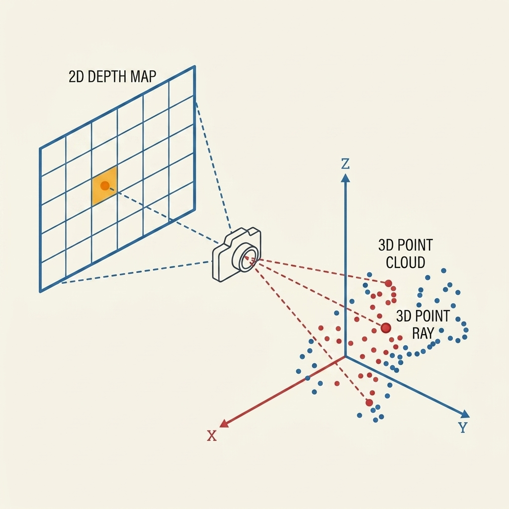

## Theory
 
### 1. From 2D Depth Image to 3D Point Cloud
 
Imagine a regular photograph. Each pixel in that photo stores a color or a brightness value. Now, imagine a different kind of image—a **depth image** (or depth map). Instead of colors, every pixel here holds a single, very important value: the distance, <i>Z</i>, from the camera to whatever surface it's looking at. It’s essentially a grayscale picture of distances. While super useful, it’s still just a flat, 2D grid.
 
To really bring this data to life—whether for taking measurements, creating meshes, or full 3D visualization—we need to pop every pixel out into actual 3D space with (<i>X</i>, <i>Y</i>, <i>Z</i>) coordinates. We call this magical process **back-projection**. When you back-project every valid pixel, you get a **point cloud**: a massive, unordered swarm of 3D points that perfectly traces the visible surface of whatever you just scanned.
 
Point clouds are basically the rockstars of 3D scanning. Whether you're using a LiDAR scanner, a structured light setup, or a stereo camera system (like we saw in Experiment 1), they all ultimately spit out a point cloud. Everything that happens next in the 3D world—like stitching scans together (Experiment 4), building solid meshes (Experiment 7), or cleaning up messy data (Experiment 8)—starts with this humble point cloud.
 
### 2. The Back-Projection Formula
 
So, how do we actually compute this? For any given pixel located at column <i>u</i> and row <i>v</i> in our depth image, with a stored depth value of <i>Z</i>, its new 3D address (<i>X</i>, <i>Y</i>, <i>Z</i>) in the camera's world is found like this:
 

  

    <i>X</i>&nbsp;=&nbsp;
    
      (<i>u</i> &minus; <i>c</i><i>x</i>) &times; <i>Z</i>
      <i>f</i><i>x</i>
    
  

  

    <i>Y</i>&nbsp;=&nbsp;
    
      (<i>v</i> &minus; <i>c</i><i>y</i>) &times; <i>Z</i>
      <i>f</i><i>y</i>
    
  

  

    <i>Z</i>&nbsp;=&nbsp;depth_value(<i>u</i>, <i>v</i>)
  

 
Let's break that down:
 
- **(u, v)**: Where the pixel lives in the 2D depth image (column and row).
- **(cx, cy)**: The camera's "principal point" (its true optical center), which we figured out during calibration in Experiment 2.
- **fx, fy**: The camera's focal lengths, measured in pixels along the horizontal and vertical axes (also from our handy calibration).
- **Z**: The actual depth value the sensor recorded at that pixel, usually in meters.

Think of this formula as the exact reverse of taking a photo. While taking a photo (Experiment 2) squishes a 3D world into a 2D image, back-projection takes a 2D image and inflates it back into 3D space. They are two sides of the same mathematical coin, and both rely heavily on knowing your camera's unique quirks (its intrinsic parameters).
 
This is exactly why we had to get Experiment 2 (calibration) right before tackling this! If your focal length (<i>f</i><i>x</i>) or optical center (<i>c</i><i>x</i>) is even slightly off, every single point in your cloud will end up in the wrong spot, leaving you with a warped, funhouse-mirror version of reality.
 

  
  
Figure 1: Back-projecting a 2D depth pixel (u,v) into a 3D coordinate (X,Y,Z)

### 3. Total Point Count and Resolution
 
Since every valid pixel gets promoted to a 3D point, the total headcount in your point cloud is simply:
 

  <i>N</i>total = image_width &times; image_height

 
This means your camera's resolution is a huge deal. If you double your camera's resolution from 320×240 to 640×480, you aren't just doubling your point count—you're *quadrupling* it! A standard depth camera running at 640×480 can churn out over 300,000 points in a single frame (assuming every pixel gets a good read). That’s a lot of data!
 
### 4. Point Spacing: Why Distance Matters
 
"Point spacing" is just a fancy way of asking: *how far apart are these dots on my scanned surface?* (usually measured in millimeters). Here's the catch: it’s not constant. It changes based on how far away the object is from the camera:
 

  &Delta;<i>s</i>&nbsp;=&nbsp;
  
    <i>Z</i>
    <i>f</i><i>x</i>
  

 
Practically speaking, this means your camera captures a much richer, denser cluster of points for objects right in front of it compared to objects far away. For example, at 1 meter away (with a 700-pixel focal length), points are a tight 1.4 mm apart. Push that object back to 3 meters, and suddenly your points are 4.3 mm apart—three times sparser! It’s the same reason it’s harder to spot tiny details on distant objects (a concept we'll dive into in Experiment 9).
 
### 5. Dealing with Sensor Noise
 
Let's face it: no sensor is perfect. Every single depth measurement has a tiny bit of random error baked into it. We usually model this "noise" as a standard bell curve (Gaussian distribution) added to the real distance:
 

  <i>Z</i>measured = <i>Z</i>true + <i>N</i>(0, &sigma;2)

 
Here, &sigma; (sigma) is our standard deviation in meters, and <i>N</i>(0, &sigma;2) is just a random error pulled from that bell curve. A typical consumer depth camera might be off by about 3 mm when looking at something 1 meter away. And just like we saw in Experiment 1, this error only gets worse the further out you look.
 
When you back-project this slightly-wrong depth data into 3D, things get interesting. A surface that is perfectly flat in real life will suddenly look a bit rough or bumpy in your point cloud. If the noise is really bad, that flat surface might even look wavy! You'll see this a lot in real-world scans, especially if you try to use infrared depth cameras outside in the bright sun.
 
### 6. Cloud Density
 
If point spacing is about the distance between dots, **cloud density** is about how tightly packed those dots are over a given area (like points per square meter):
 

  &rho;&nbsp;=&nbsp;
  
    <i>N</i>valid
    <i>A</i>surface
  

 
Where <i>N</i>valid is the number of successfully measured points, and <i>A</i>surface is the physical area they cover. Just like point spacing, density isn't uniform. Objects close to the camera get packed with points, while distant background objects look sparse and ghostly. Knowing your density is crucial for figuring out if your scan has enough detail to actually do what you want with it, like picking out a small feature or printing a smooth 3D model.
 
### 7. The Mystery of Flying Pixels
 
Here’s a fun (and annoying) glitch: what happens at the very edge of an object? When your camera looks right at the boundary where a foreground object meets the background, the sensor gets confused. It might spit out a depth value that’s halfway between the two. 
 
When you back-project that confused pixel, it turns into a bizarre, isolated dot hovering in mid-air between the object and the background. We lovingly call these **"flying pixels"** or edge artifacts. They are prime targets for the cleanup algorithms we'll play with in Experiment 8.
 
### 8. Why Care About Point Clouds?
 
At the end of the day, the point cloud is the absolute bedrock of 3D scanning. Before you can measure a scanned part, compare it to a CAD model, 3D print it, or align it with another scan, it has to be a point cloud first. Understanding how your camera's resolution, the distance to your object, and unavoidable sensor noise all shape this cloud is the key to unlocking all the advanced 3D magic that comes next!
