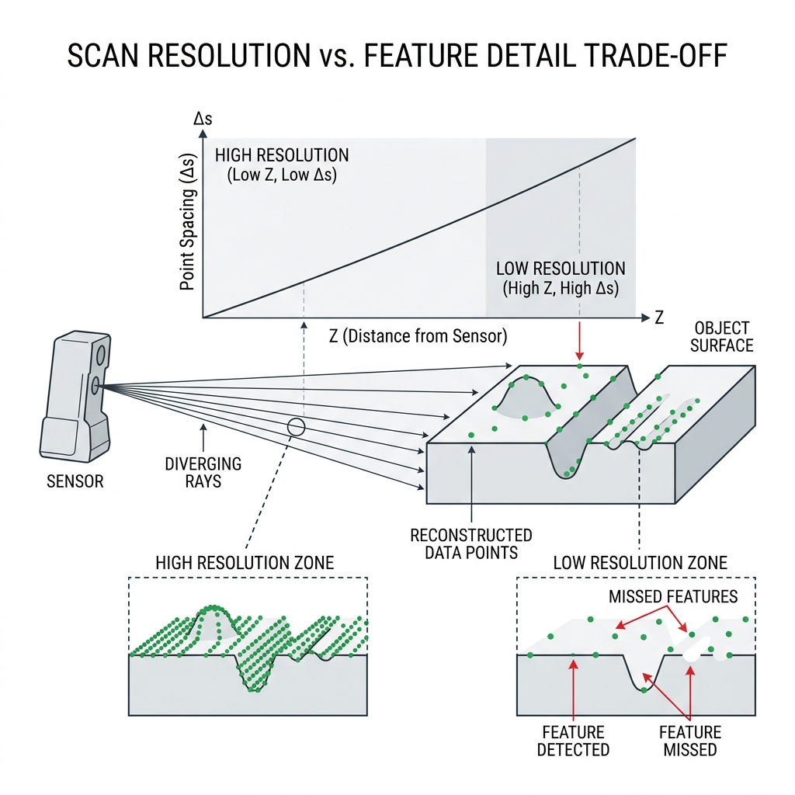

## Theory
 
### 1. The Central Question of Scan Planning
 
Every 3D scanning session, before it even begins, requires a decision about resolution - how finely to sample the surface. This decision cannot be made in isolation. It depends on the smallest feature the task requires the scan to resolve, the distance at which scanning will occur, and the time and data budget available. Setting resolution too coarse risks missing the features that matter to the task; setting it too fine wastes scanning time, storage space, and processing effort on detail that serves no purpose. This experiment brings together concepts from Experiments 1, 3, and 5 - point spacing, angular resolution, and the geometry of feature detectability - into a single, unified planning framework.

  
  
Figure 1: The relationship between scanning distance, point spacing, and feature detectability.

 
### 2. Point Spacing Revisited
 
As established in Experiment 3, the physical spacing between adjacent points sampled on a surface is governed by:
 

  &Delta;<i>s</i>&nbsp;=&nbsp;
  
    <i>Z</i>
    <i>f</i><i>x</i>
  

 
Where Z is the distance from the sensor to the surface and fx is the focal length in pixels. This same relationship, expressed through angular resolution for a rotating LiDAR sensor (Experiment 5), gives:
 

  &Delta;<i>s</i>&nbsp;&approx;&nbsp;<i>Z</i>&nbsp;&times;&nbsp;&theta;<i>res</i>

 
Where θ_res is the angular resolution in radians. Both formulas express the same underlying physical principle: for a fixed sensor configuration, point spacing grows linearly with scanning distance. Bringing the sensor closer to the object, or increasing its native pixel/angular resolution, is the only way to reduce point spacing.
 
### 3. The Nyquist-Like Sampling Requirement
 
A feature on a surface - a small raised bump, an engraved line, a narrow slot - can only be reliably detected if it is sampled by a sufficient number of measurement points. Drawing on the same logic as the Nyquist sampling theorem in signal processing (which states that a signal must be sampled at more than twice its highest frequency to be reconstructed without aliasing), a practical rule of thumb for point cloud feature detection is:
 

  feature size&nbsp;&ge;&nbsp;(2 to 3)&nbsp;&times;&nbsp;&Delta;<i>s</i>

 
A feature smaller than roughly twice the point spacing risks falling entirely between two adjacent measurement points, going completely undetected even though the sensor is functioning correctly and the feature is physically present within range. A feature that is 5 to 10 times larger than the point spacing is comfortably over-sampled, captured by many points and easily distinguished from measurement noise.
 
This is not a hard cutoff but a probabilistic threshold - a feature exactly at 2× point spacing has a meaningful chance of being missed depending on its exact position relative to the sampling grid, while a feature at 5× point spacing is reliably captured almost every time regardless of grid alignment.
 
### 4. Combining Distance and Resolution
 
Given a required feature size f_min that the task must detect, and a chosen safety margin m (typically 3 to 5), the maximum permissible point spacing is:
 

  &Delta;<i>s</i><i>max</i>&nbsp;=&nbsp;
  
    <i>f</i><i>min</i>
    <i>m</i>
  

 
This maximum spacing then determines the maximum usable scanning distance for a given sensor's focal length:
 

  <i>Z</i><i>max</i>&nbsp;=&nbsp;&Delta;<i>s</i><i>max</i>&nbsp;&times;&nbsp;<i>f</i><i>x</i>

 
Scanning beyond Z_max risks missing the target feature. Scanning much closer than necessary does not improve detection (once the feature is comfortably over-sampled, additional resolution provides diminishing returns) but does increase point count, processing time, and storage requirements without commensurate benefit.
 
### 5. Total Scan Time and Data Volume
 
Resolution choices directly affect two practical resources: scan time and data volume. For a rotating LiDAR sensor (Experiment 5), the number of pulses required per rotation scales inversely with angular resolution:
 

  <i>N</i>&nbsp;=&nbsp;
  
    360&deg;
    &theta;<i>res</i>
  

 
Halving θ_res (doubling angular resolution) doubles the required pulse count per rotation, which - for a fixed pulse frequency - either doubles the time required for one complete rotation or requires the pulse frequency itself to double to maintain the same rotation speed.
 
For an image-based sensor (stereo, structured light), doubling linear resolution in both image dimensions quadruples the total pixel count and therefore roughly quadruples both processing time and the storage size of the resulting point cloud, following the same N = W × H relationship established in Experiment 3.
 
### 6. The Resolution-Time-Detail Triangle
 
These relationships create a three-way trade-off that scan planning must navigate:
 
- **High resolution + short scan time** - requires either being very close to the object (reducing the physical area covered per scan, requiring more scans to cover a large object) or using very high-end, fast-sampling hardware.
- **High resolution + full object coverage** - requires either a very long scan time or specialised wide-field, high-resolution sensors that are typically more expensive.
- **Fast scan time + full object coverage** - necessarily sacrifices resolution somewhere, risking missed fine features.
No single scan configuration optimises all three simultaneously; the correct choice depends entirely on which fine features the specific application actually requires to be captured.
 
### 7. Practical Feature Examples and Required Resolution
 
To make the abstract relationship concrete, typical real-world feature sizes and their approximate required point spacing (using a safety margin of m = 4) include:
 
| Feature type | Typical size | Required Δs_max |
|---|---|---|
| Large casting or structural surface | 20+ mm | 5 mm |
| Machined bolt hole or edge | 5-10 mm | 1.5-2.5 mm |
| Engraved text or fine groove | 1-2 mm | 0.25-0.5 mm |
| Surface texture / fine tooling marks | 0.1-0.5 mm | 0.025-0.125 mm |
 
Each successive row demands roughly an order of magnitude finer point spacing, which - per Δs = Z/fx - requires either dramatically reducing scanning distance or using a sensor with dramatically higher native resolution, both of which come with corresponding cost, complexity, and coverage-area trade-offs.
 
### 8. Downsampling as the Inverse Problem
 
The inverse of the resolution-planning problem studied here is downsampling - deliberately reducing the resolution of an already-captured, over-sampled point cloud to reduce processing burden for a downstream task that does not require the original fine detail. Voxel grid downsampling, a standard technique, divides 3D space into a regular grid of cubic cells (voxels) and retains only one representative point per occupied voxel:
 

  voxel size&nbsp;&approx;&nbsp;(2 to 3)&nbsp;&times;&nbsp;required feature resolution

 
Choosing a voxel size much larger than required destroys genuine detail; choosing it much smaller than necessary provides no computational benefit over the original dense cloud.
 
### 9. Connection to the Broader Pipeline
 
This experiment sits conceptually above the individual sensing technologies studied in Experiments 1 through 6 - it is the planning layer that determines what resolution and distance settings those sensors should actually be configured with, given a specific real-world task. A structural engineer scanning a bridge for large-scale deformation needs very different resolution planning than a metrologist scanning a machined part for sub-millimetre tolerance verification, even though both might use similar underlying sensor technology. Understanding this trade-off is what separates competent scan planning from guesswork, and directly prevents the common real-world failure mode of completing an expensive scanning session only to discover afterward that a critical feature was never captured because the resolution was insufficient for its scale.

