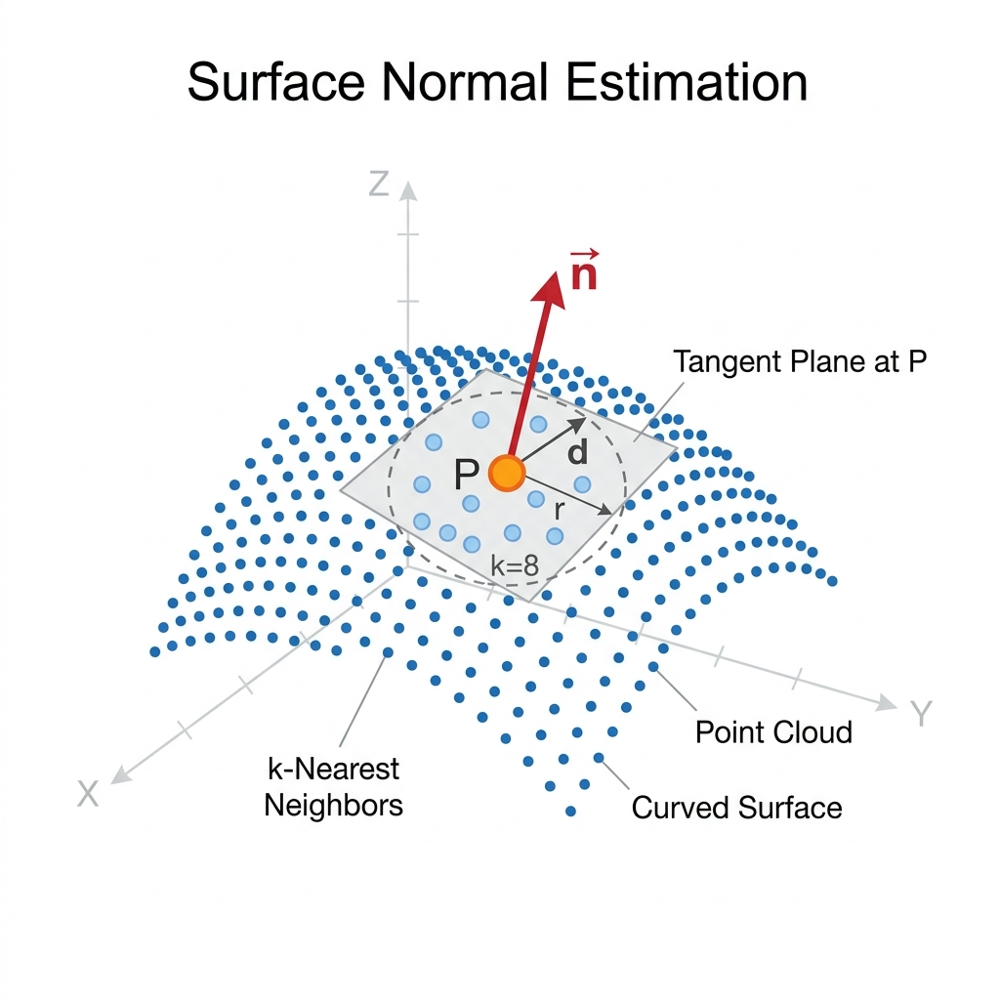

## Theory

### 1. From Point Clouds to Surfaces

When a 3D scanner captures an object, the raw output is simply a list of coordinates (X, Y, Z) known as a **point cloud**. While this cloud gives us a sense of the object's shape, it's completely unstructured. If you pick a single point, the scanner doesn't tell you whether it's sitting on a smooth flat surface, a curved bump, or a sharp edge. 

To do anything useful with this data-like creating a 3D mesh for 3D printing, rendering it in a video game, or running engineering simulations-we need to know the orientation of the surface at every single point. This is where **surface normal estimation** comes in. It acts as the critical bridge that transforms a raw, scattered point cloud into a continuous, understandable 3D surface.

### 2. What is a Surface Normal?

A **surface normal** at a specific point is simply a unit vector (often denoted as **n**) that points perfectly straight out from the surface, completely perpendicular to it.

- On a flat table, all normals point straight up in the exact same direction.
- On a sphere, the normals fan outward smoothly.
- At a sharp corner, the normals abruptly change direction. 

A normal vector has three components (nx, ny, nz) and must satisfy the unit length requirement:

  ||<i>n</i>|| = &radic;(<i>nx</i>2 + <i>ny</i>2 + <i>nz</i>2) = 1

One tricky aspect of normals is that mathematically, a plane has two perpendicular directions (pointing "outward" or "inward"). For a 3D mesh to look correct and behave predictably, we have to make sure all normals consistently point *outward*.

  
  
Figure 1: Estimating the perpendicular surface normal from a local neighbourhood of points.

### 3. Using PCA to Find the Normal

The most common way to estimate the normal for a point **P** is to look at its closest neighbours using a technique called **Principal Component Analysis (PCA)**.

**Step 1 - Gather Neighbours:** We find the **k** points closest to **P**. This group forms our local neighbourhood.

**Step 2 - Find the Center:** We calculate the centroid (or average position) of these **k** points:

  <i>P&#772;</i>&nbsp;=&nbsp;
  
    1
    <i>k</i>
  
  &nbsp;&sum; <i>Pi</i>

**Step 3 - Build the Covariance Matrix:** We create a 3x3 matrix that describes how the points are scattered around the centroid:

  <i>C</i>&nbsp;=&nbsp;
  
    1
    <i>k</i>
  
  &nbsp;&sum; (<i>Pi</i> &minus; <i>P&#772;</i>)(<i>Pi</i> &minus; <i>P&#772;</i>)T

**Step 4 - Find the Eigenvectors:** We compute the eigenvalues (&lambda;0 &le; &lambda;1 &le; &lambda;2) and their matching eigenvectors for this matrix.

**Step 5 - The Normal is the Smallest Eigenvector:** The eigenvector associated with the smallest eigenvalue (&lambda;0) tells us the direction where the points vary the *least*. Because points on a surface tend to spread out flatly rather than pushing away from the surface, this direction of least variance is our estimated surface normal!

### 4. The Neighbourhood Size (k) Trade-off

Choosing how many neighbours (**k**) to include is the most important decision in this process:

- **Small k (e.g., k = 5):** The algorithm only looks at the immediate surroundings. This preserves sharp edges and tiny details beautifully. However, if your scanner is noisy, small groups of points will wildly skew the normal directions.
- **Large k (e.g., k = 50):** The algorithm averages a much larger patch of points. This acts like a smoothing filter, completely ignoring sensor noise. The downside? Sharp edges get smoothed out, and tight corners become blurry and distorted.

Finding the right balance depends entirely on how clean your scan is and how much fine detail you need to capture.

### 5. Estimating Surface Curvature

PCA doesn't just give us the normal direction; the eigenvalues also tell us how flat or curved the surface is. We estimate the curvature (&kappa;) as:

  <i>&kappa;</i>&nbsp;=&nbsp;
  
    &lambda;0
    &lambda;0 + &lambda;1 + &lambda;2
  

If the surface is perfectly flat, all the points lie on a plane, so the variance in the normal direction (&lambda;0) is near zero, making &kappa; &approx; 0. When the surface curves heavily (or has lots of noise), &lambda;0 grows larger, increasing the curvature score. Points with high curvature are often the most interesting geometric features of an object.

### 6. Making Normals Consistent

As mentioned earlier, PCA tells us the line the normal sits on, but not whether it points "out" or "in." We have to flip normals to ensure they all face the same way.

- **Viewpoint Orientation:** If we know exactly where the 3D scanner was sitting when it took the measurement, we simply force every normal to point roughly back toward the scanner's viewpoint. This is highly reliable.
- **Propagation:** If we don't know the scanner position, we pick one normal and "propagate" its direction to its neighbours. If a neighbour's normal is pointing more than 90 degrees away from it, we flip it. This works well but can sometimes fail at sharp corners or thin edges.

### 7. Generating the Mesh

Once every point has a reliable normal, we can finally stitch the point cloud into a solid 3D mesh using a "greedy triangulation" algorithm:

1. **Projection:** For every point, we take its local neighbours and project them flat onto its tangent plane (using the normal we just calculated).
2. **Delaunay Triangulation:** We draw triangles between these flattened 2D points. The Delaunay method ensures we avoid long, thin "sliver" triangles by maximizing the internal angles.
3. **Filtering:** We reject any triangles that have edge lengths that are too long (which might incorrectly bridge two separate parts of the object) or angles that are too weird.
4. **Growth:** We continue stitching triangles outward from the initial points until the entire surface is covered.

### 8. Evaluating the Mesh

How do we know if our generated mesh is actually good? We look at two main things:
- **Normal Consistency:** If you walk from one triangle to the next on a smooth surface, the normals shouldn't dramatically change direction. A high consistency score means our surface is smooth and continuous.
- **Triangle Quality (Minimum Angle):** The healthiest triangles are close to equilateral (angles near 60&deg;). If the minimum angle is incredibly small (like 5&deg;), the triangle is long and needle-like, which causes massive headaches for physics engines and rendering software.
